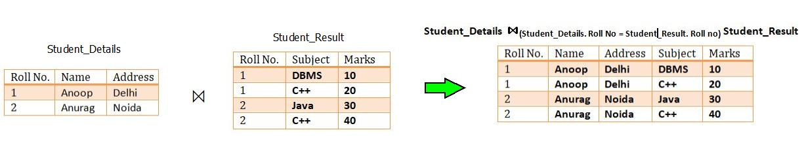
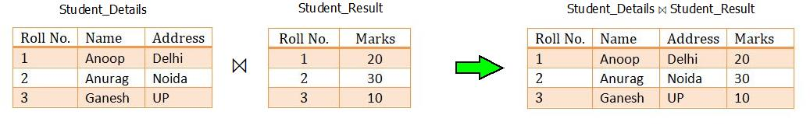
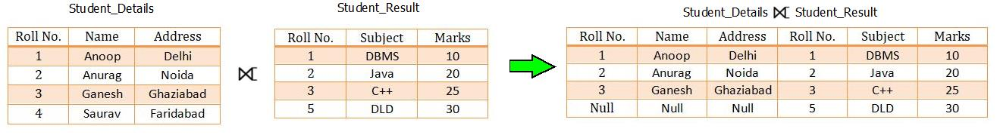
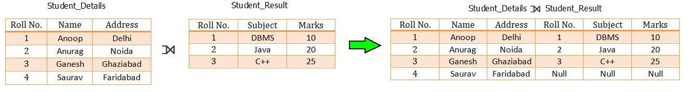
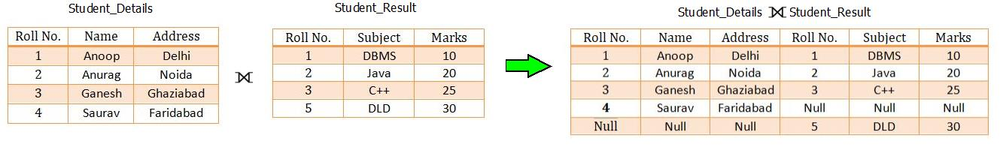

# OPB

## Tipi stikov
- Stik Theta (Theta join)

- Ekvistik (Equijoin) poseben primer stika Theta)
  
- Naravni stik (Natural join)
  
- Odprti stik (Outer join)
  - right
  
  - left
  
  - full
  
- Delni stik (Semijoin)

## Agregatne operacije

$$𝚪(R)$$

