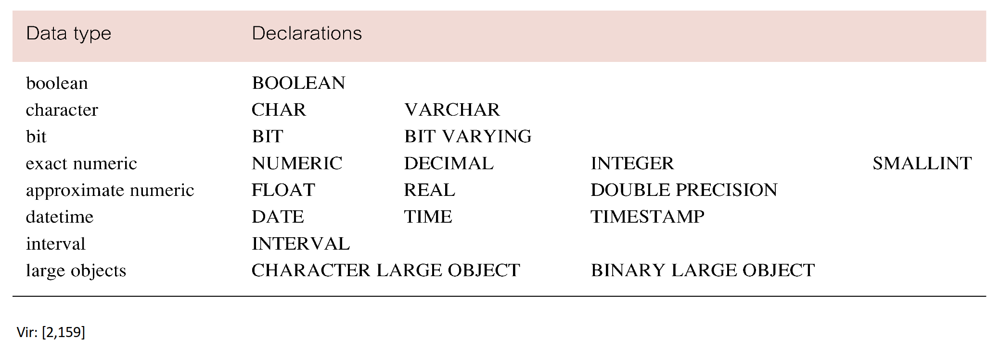
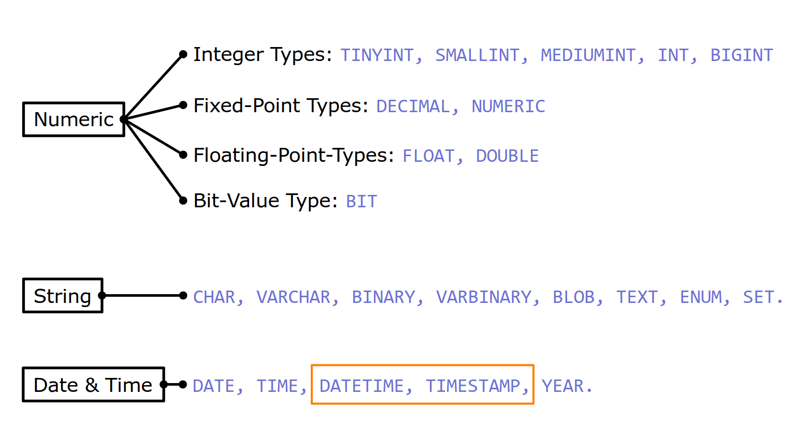

# Ukazi 
- Ukazi iz skupine DML:  ```SELECT, INSERT, UPDATE, DELETE```
- Ukazi iz skupine DDL: ```CREATE, ALTER, SET TRANSACTION,...```

SQL sestavljata dve skupini ukazov:
1. Skupina ukazov za DDL (Data Definition Language) za opredelitev
strukture podatkovne baze in
1. Skupina ukazov za DML (Data Manipulation Language) za
poizvedovanje in ažuriranje podatkov.

```sql
create table oseba (
    EMŠO number (13),
    ime char(20),
    priimek char(20)
)
```

```sql
select ime, priimek
from oseba
where ime = 'Tine'
order by priimek
```

> Do 1999 SQL brez ukazov za kontrolni tok - potrebno obvladati s programskim jezikom ali interaktivno.

</br></br>

# Stavki skupine SQL DML:

1. DML skupina zajema SQL stavke za manipulacijo s podatki
1. SELECT - Izbira
1. INSERT - Dodajanje
1. DELETE - Brisanje
1. UPDATE - Spreminjanje
> Sintaksa SELECT stavka najbolj kompleksna


</br></br>
## SELECT stavek...
```sql
SELECT [DISTINCT | ALL]
{* | [columnExpression [AS newName]] [,...] }
FROM TableName [alias] [, ...]
[WHERE condition]
[GROUP BY columnList]
[HAVING condition]
[ORDER BY columnList]
```
> SELECT Določa stolpce, ki naj se pojavijo v izhodni relaciji

1. ```FROM``` Določa tabele za poizvedbo
1. ```WHERE``` Filtrira vrstice
1. ```GROUP``` BY Združuje vrstice po vrednostih izbranih stolpcev
1. ```HAVING``` Filtrira skupine glede na določene pogoje
1. ```ORDER BY``` Določa vrstni red vrstic na izhodu

## Primeri na podlagi sheme employlees 
```
employees(emp_no, birth_date, first_name, last_name, gender,
hire_date)
titles(emp_no, title, from_date, to_date)
salaries(emp_no, salary, from_date, to_date)
dept_emp(emp_no, dept_no, from_date, to_date)
departments(dept_no, dept_name)
dept_manager(dept_no, emp_no, from_date, to_date
```

## Pravila formtiranja SQL primerov:

- SQL izrazi so neobčutljivi na velikost črk.
- Barve niso predpisane.
- Rezervirane besede SQL ne smemo uporabljati za definicije
podatkovnih objektov (tabel, stolpcev itn.)
- Sintaksa, ki jo bomo uporabljali za primere:

```sql
select * from employees where ime = 'Marko'
```

## Enostaven izpis...
- Izpiši vse podatke o zaposlenih
```sql
select * from employees;
```
- Izpiši imena in priimke zaposlenih

```sql
select first_name, last_name from employees;
```

- Izpiši starost delavcev ob zaposlitivi

```sql
select first_name, last_name, birth_date, hire_date, DATEDIFF(hire_date birth_date)/365 as 'Starost ob zaposlitvi' from employees;
```

je enako kot

```sql
select first_name, last_name, YEAR(hire_date)-YEAR(birth_date) as 'Starost ob zaposlitvi' from employees;
```

> SQL ne loci velikih in malih crk pri sintaksi

### Iskanje z uporabo BETWEEN
- Izpiši zaposlene rojene med 30. in 31. decembrom 1953.
```sql
select * from employees where birth_date between '1955-12-30' and '1955-12-31';
```

-Izpiši podatke o delovnih mestih, kjer gre za delovno mesto staff
ali senior staff.
```sql
select * from titles where title in ('Staff’, 'Senior Staff');
```

## Iskanje po članstvu množice
- Izpiši podatke o delovnih mestih, kjer gre za delovno mesto staff
ali senior staff.

```sql
select * from titles
where title in ('Staff’, 'Senior Staff');
```

## Iskanje z vzorcem
- Izpiši vse zaposlene, ki se pišejo na ‘B’ in so se rodili prvega v
mesecu v šestdesetih letih.

```sql
select * from employees
where last_name like 'B%' and
birth_date like '_ _6_ _ _ _ _01';
```

## NULL

```sql
select * from employees
where hire_date is null;
```

## Sortiranje vrstic v izhodni relaciji
- Izpiši podatke o zaposlenih sortirane po priimku naraščujoče in po
datumu rojstva padajoče.

```sql
select emp_no, last_name, birth_date
from employees
order by last_name, birth_date desc;
```

# Agregiranje podatkov...
1. ```ISO``` standard definira pet agregarnih operacij
1. ```COUNT``` vrne število vrednosti v določenem stolpcu
1. ```SUM``` vrne seštevek vrednosti v določenem stolpcu
1. ```AVG``` vrne povprečje vrednosti v določenem stolpcu
1. ```MIN``` vrne najmanjšo vrednost v določenem stolpcu
1. ```MAX``` vrne največjo vrednost v določenem stolpcu

- Če se želimo znebiti duplikatov, uporabimo DISTINCT pred
imenom stolpca.
- DISTINCT nima učinka na MIN/MAX, lahko pa vpliva na SUM/AVG.
- Agregarne operacije lahko uporabimo le v SELECT ali HAVING
sklopu

## Gnezdenje poizvedb...
- Vgnezdeni SELECT stavki se lahko uporabijo v WHERE ali HAVING
sklopih drugega SELECT stavka (subselect).

```sql
select first_name, last_name
from employees
where emp_no in (
select emp_no
from titles
where title = 'manager'
);
```

## Primer vgnezdenega stavka...WHERE
- Izpiši imena in priimke zaposlenih, ki so delali na vsaj treh
delovnih mestih.

```sql
select first_name, last_name
from employees
where emp_no in (
select emp_no
from titles
group by emp_no
having count(*) > 2
);
```

## Primer vgnezdenega stavka ... FROM
- Izpiši najvišjo povprečno plačo.

```sql
select max(dE.avgSalary)
from (
select avg(salary) as avgSalary
from salaries
group by emp_no
) dE;
```


## Pravila gnezdenja SELECT stavkov...
- Pravila vgnezdenih SELECT stavkov...:
- Uporaba ORDER BY v vgnezdenem stavku nesmiselna.
- SELECT vgnezdenega stavka lahko zajema samo en stolpec (razen v
primeru uporabe ukaza EXISTS.
> Mnoge implementacije tega ne upoštevajo. Tudi mySQL.

```sql
select... where (emp_no, title) in (
select emp_no, title from...
);
```

- Pravila vgnezdenih SELECT stavkov...:
- Imena stolpcev v vgnezdenem stavku se nanašajo na tabele iz
vgnezdenega ali zunanjega stavka (uporaba alias-ov)

```sql
select E.emp_no, E.first_name, E.last_name
from employees E
where E.emp_no in (
select S.emp_no
from salaries S
where E.birth_date >= S.from_date
);
```

# Poizvedbe po vec tabelah

> Za ločevanje med istoimenskimi stolpci uporabljamo sinonime (alias).

```sql
select E.emp_no, E.first_name, E.last_name
from employees E, dept_manager DM, departments D
where
E.emp_no = DM.emp_no AND
DM.dept_no = D.dept_no AND
D.dept_name = 'marketing';
```

## Alternativni načini stika več tabel
- Alternativni načini stika med več tabelami:
  - ```sql
    FROM employees E JOIN titles T ON E.emp_no = T.emp_no
    ```

  - ```sql
    FROM employees JOIN titles USING emp_no
    ```

  - ```sql
    FROM employees NATURAL JOIN titles
    ```
  

Zgornji zapisi nadomestijo sklopa ```FROM``` in ```WHERE```

- V prvem primeru rezultat vsebuje dva identična stolpca em
  
</br></br></br>

# Podatkovni tipi v ```SQL```





# Zagotavljanje kakovosti podatkov

- SQL standard ponuja več vrst omejitev (**Integrity Enhacement
Fetures**):
- Obveznost podatkov
- Omejitve domene (**Domain constraints**)
- Pravila za celovitost podatkov (**Integrity constraints**)
  - Celovitost entitet (**Entity Integrity**)
  - Celovitost povezav (**Referential Integrity**)
- Števnost (**Multyplicity**)
- Splošne omejitve (**General constraints**)
- Omejitve so lahko definirane v ```CREATE``` in ```ALTER TABLE``` stavkih.

```sql
emp_no numeric(5) NOT NULL
```


```sql
gender CHAR NOT NULL CHECK (gender in ('M', 'F'))
```

## Kreiranje domene
```sql
CREATE DOMAIN DomainName [AS] dataType [DEFAULT defaultOption] [CHECK (searchCondition)]
```

1. ### Kreiranje domene
```sql
CREATE DOMAIN Tgender AS CHAR CHECK (VALUE IN ('M', 'Ž')); 
```
2. ### Sklicovanje
```sql
gender Tgender NOT NULL
```
> Kako ravnati, ce je domena trenutno v uporabi

```sql
DROP DOMAIN DomainName [RESTRICT | CASCADE]
```
> cascade je sql injection type shit

Vsak ```INSERT/UPDATE``` stavek, ki skuša kreirati FK vrednost v
tabeli, brez da bi ta vrednost obstajala kot PK v povezani tabeli, je
zavrnjen.
Ob zavrnitvi so možne naslednje akcije
- ```CASCADE```
- ```SET NULL```
- ```SET DEFAULT``` 
- ```NO ACTION```

Kreiranje podatkovnih objektov
SQL DDL omogoča kreiranje in brisanje podatkovnih objektov, kot
so: shema, domena, tabela, pogled in indeks.

- Glavni SQL DDL stavki:


```sql
CREATE SCHEMA DROP SCHEMA
```

```sql
CREATE/ALTER DOMAIN DROP DOMAIN
```

```sql
CREATE/ALTER TABLE DROP TABLE
```

```sql
CREATE/ALTER VIEW DROP VIEW
```

```sql
CREATE INDEX DROP INDEX
```

## Kako kreiramo podatkovno bazo??


1. ### Kreiramo in izberemo podatkovno bazo 
```sql
create database filmoteka;
use filmoteka;
```
2. ### Kreiramo tabelo Avtor

```sql
create table avtor (
    avtor_id int(4),
    ime char(20) not null,
    priimek char(20) not null,
primary key (avtor_id));
```
3. ### Kreiramo ostale podatkoven tabele

```sql
create table zanr (
    zanr_id int(4),
    naziv char(50) not null,
primary key (zanr_id));
create table tip (
    tip_id int(4),
    naziv char(50) not null,
primary key (tip_id));
create table jezik (
    jezik_id int(4),
    naziv char(50) not null,
primary key (jezik_id));
```

4. ### Kreiramo tabelo film

```sql
create table film (
    film_ID int(6),
    naslov char(50),
    zanr int(4),
    ocenaIMDB decimal(4,1),
    mojaOcena decimal(4,1),
    tip int(4),
    jezik int(4),
    videno bit,
primary key (film_id),
...
```

5. ### ...Povezave na druge tabele

```sql
...
  constraint fk_tip foreign key (tip)
      references tip(tip_id) on delete cascade,
  constraint fk_jezik foreign key (jezik)
      references jezik(jezik_id) on delete cascade,
  constraint fk_zanr foreign key (zanr)
      references zanr(zanr_id) on delete cascade
);
```


</br></br></br>
> od tu naprej je branje tega skripta izkljucno na lastno odgovornost
# Da ne pozabimo!!! (Vodlanove fantazije)
```sql
select dildo from domen-ass where color = "red" and tetas = "big";
```


