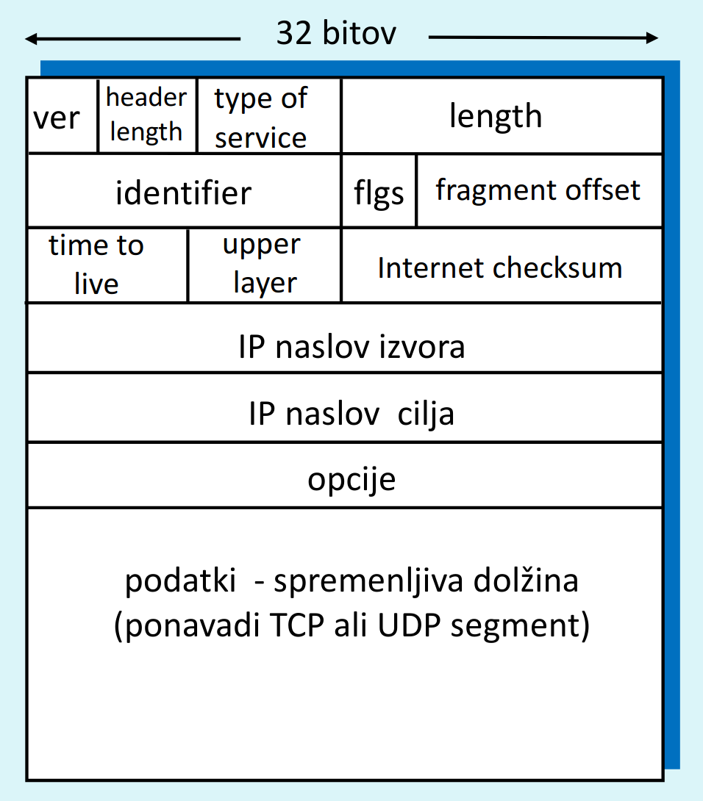

# Razčlenitev IP protokola

## VER (4b): 
verzija IP protokola

## HEADER LENGTH (4b):
 dolžina glave
(v 32-bitnih besedah), poda, kje se začnejo podatki

## TYPE OF SERVICE (8b): za razlikovanje datagramov, ki
potrebujejo "posebno" obravnavo

## LENGTH (16b): skupna dolžina celega datagrama v
Byte-ih (običajno dolžina 1500B)

## ID, FLAGS, OFFSET (32b): potrebno za IP
fragmentacijo (razbitje podatkov na več delov)
TL (8b): za preprečitev ciklanja datagramov po
omrežju, vsak usmerjevalnik zmanjša vrednost za 1

## UPPER LAYER (PROTOCOL) (8b): številka
enkapsuliranega protokola v podatkih (6-TCP, 17-UDP)

## CHECKSUM (16b): kontrolna vsota (samo) glave
datagrama, preračuna jo vsak usmerjevalnik

## IP naslovi (32b): naslovi izvora in cilja (začetnega in
končnega sistema)

## OPCIJE (32b): za možne razširitve glave datagrama
(slabosti: večji čas procesiranja, neznana lokacija
začetka podatkov; običajno jih ni, glava dolga 20B)

## PODATKI (spremenljiva dolžina)
